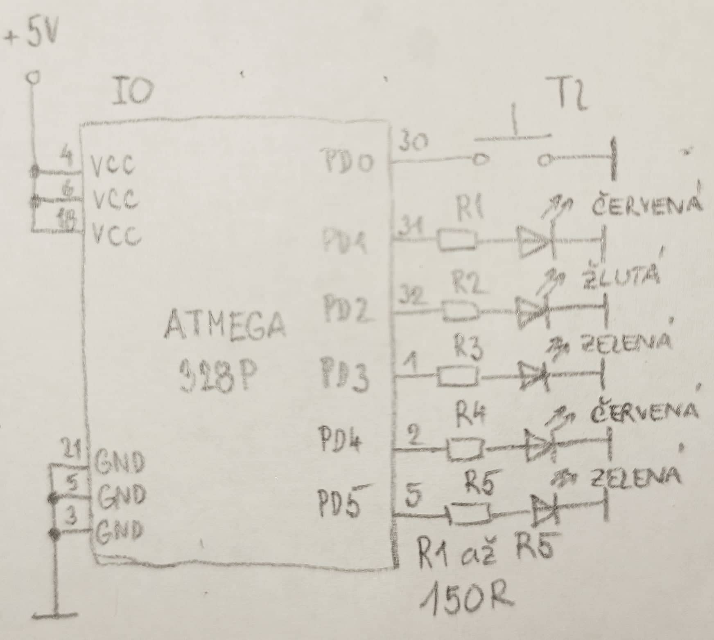

https://github.com/xhorna16/Digital-electronics-2
## Preparation tasks
1. Fill in the following table and enter the number of bits and numeric range for the selected data types defined by C.

| **Data type** | **Number of bits** | **Range** | **Description** |
| :-: | :-: | :-: | :-- | 
| `uint8_t`  | 8 | 0, 1, ..., 255 | Unsigned 8-bit integer |
| `int8_t`   | 8 | -128...+127 | Signed 8-bit integer |
| `uint16_t` | 8 | 0...65535 | Unsigned 16-bit integer |
| `int16_t`  | 16 | -32768...+32767 | Signed 16-bit integer |
| `float`    | 32 | -3.4e+38, ..., 3.4e+38 | Single-precision floating-point |
| `void`     | 0 |  |  |

2. Any function in C contains a declaration (function prototype), a definition (block of code, body of the function); each declared function can be executed (called). Study [this article](https://www.programiz.com/c-programming/c-user-defined-functions) and complete the missing sections in the following user defined function declaration, definition, and call.

```C
#include <avr/io.h>

// Function declaration (prototype)
uint16_t calculate(uint8_t, uint8_t); //jak vypadá

int main(void)
{
    uint8_t a = 156;
    uint8_t b = 14;
    uint16_t c;

    // Function call
    c = calculate (a, b);

    while (1)
    {
    }
    return 0;
}

// Function definition (body)
...      calculate(uint8_t x, uint8_t y) //jak se chová
{
    uint16_t result;    // result = x^2 + 2xy + y^2

    result = x*x;
    	result += 2*x*y;
	result += y*y;
    return result;
}
```
## GPIO Library
Deklarace funkce oznamuje samotnou přítomnost funkce a vyjadřuje, jaké druhy proměnných tvoří vstupy a výstupy funkce.
Definice funkce popisuje chování funkce, tj. její práci se zadanými vstupními údaji, jsou-li nějaké, např. matematickým vztahem.
## Part of C code
```c
int main(void)
{
    // Green LED at port B
    GPIO_config_output(&DDRB, LED_GREEN); // nastavim vystup // proc je tam & ??
    GPIO_write_low(&PORTB, LED_GREEN); // nastavim na nulu

    // Configure the second LED at port C
    GPIO_config_output(&DDRC, LED2); // nastavim vystup
    GPIO_write_high(&PORTC, LED2);

    // Configure Push button at port D and enable internal pull-up resistor
    GPIO_config_input_pullup(&DDRD, BUTTON);

    // Infinite loop
    while (1)
    {
        // Pause several milliseconds
        //_delay_ms(BLINK_DELAY);
        if (GPIO_read(&PIND, BUTTON) == 0) {
	        _delay_ms(BLINK_DELAY);
	        GPIO_toggle(&PORTC, LED_RED);
	        GPIO_toggle(&PORTB, LED_GREEN);
        }

    // Will never reach this
    return 0;
    }
```
## Traffic light

