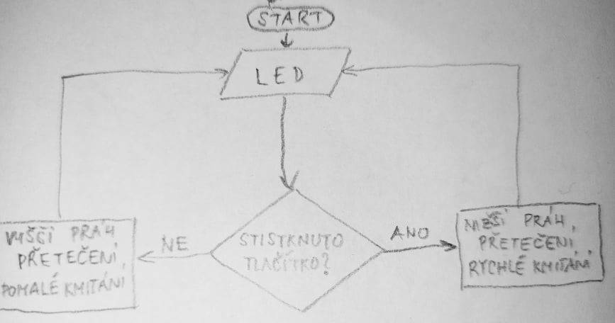
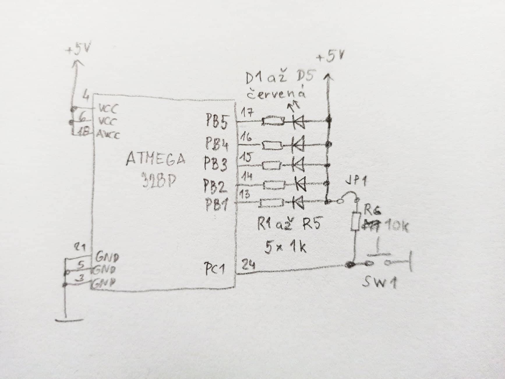

## Preparation tasks
&nbsp;

&nbsp;

1. Calculate the overflow times for three Timer/Counter modules that contain ATmega328P if CPU clock frequency is 16&nbsp;MHz. Complete the following table for given prescaler values. Note that, Timer/Counter2 is able to set 7 prescaler values, including 32 and 128 and other timers have only 5 prescaler values.

| **Module** | **Number of bits** | **1** | **8** | **32** | **64** | **128** | **256** | **1024** |
| :-: | :-: | :-: | :-: | :-: | :-: | :-: | :-: | :-: |
| Timer/Counter0 | 8  | 16u | 128u | -- | 1.024m | -- | 4.096m | 16.384m |
| Timer/Counter1 | 16 | 4.096m | 32.768m | -- | 262.144m | -- | 1.048576 | 4.194304 |
| Timer/Counter2 | 8  | 16u | 128u | 512u | 1.024m | 2.048m | 4.096m | 16.384m |

## Timer library
1. Funkce - popis činnosti, kterou bude mikrokontrolér po zavolání provádět
ISR - popis činnosti, kterou mikrokontrolér provede, nastane-li vnitřní nebo vnější impuls, daný hardwarem. Současně se přitom na čas přeruší vykonávání příkazů z progamu, které byly dosud vykonávány.
2.
```c
#define TIM1_stop()           TCCR0B &= ~((1<<CS02) | (1<<CS01) | (1<<CS00));
/** @brief Set overflow 4ms, prescaler 001 --> 1 */
#define TIM1_overflow_4ms()   TCCR0B &= ~((1<<CS02) | (1<<CS01)); TCCR1B |= (1<<CS00);
/** @brief Set overflow 33ms, prescaler 010 --> 8 */
#define TIM1_overflow_33ms()  TCCR0B &= ~((1<<CS02) | (1<<CS00)); TCCR1B |= (1<<CS01);
/** @brief Set overflow 262ms, prescaler 011 --> 64 */
#define TIM1_overflow_262ms() TCCR0B &= ~(1<<CS02); TCCR1B |= (1<<CS01) | (1<<CS00);
/** @brief Set overflow 1s, prescaler 100 --> 256 */
#define TIM1_overflow_1s()    TCCR0B &= ~((1<<CS01) | (1<<CS00)); TCCR1B |= (1<<CS02);
/** @brief Set overflow 4s, prescaler // 101 --> 1024 */
#define TIM1_overflow_4s()    TCCR0B &= ~(1<<CS01); TCCR1B |= (1<<CS02) | (1<<CS00);
/** @brief Enable overflow interrupt, 1 --> enable */
#define TIM1_overflow_interrupt_enable()  TIMSK0 |= (1<<TOIE0);
/** @brief Disable overflow interrupt, 0 --> disable */
#define TIM1_overflow_interrupt_disable() TIMSK0 &= ~(1<<TOIE0);
```

## Knight rider

