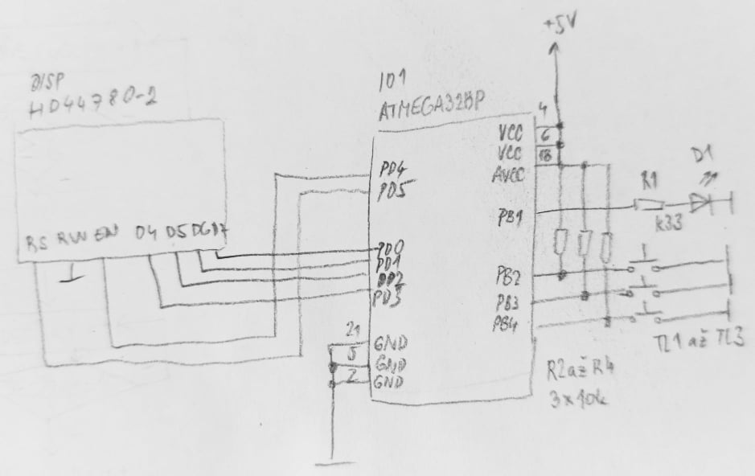

# Lab 6: YOUR_FIRSTNAME FAMILYNAME

Link to this file in your GitHub repository:

https://github.com/xhorna16/Digital-electronics-2/edit/main/Labs/06-lcd/README.md


### LCD display module

1. In your words, describe what ASCII table is.
   * ASCII table: Jedná se o seznam znaků, kterým jsou přiřazeny adresy tvořené čísly šestnáctkové soustavy, pomocí nichž se na potřebné znaky odkazuje.

2. (Hand-drawn) picture of time signals between ATmega328P and LCD keypad shield (HD44780 driver) when transmitting three character data `De2`.

   


### Stopwatch

1. Flowchart figure for `TIMER2_OVF_vect` interrupt service routine which overflows every 16&nbsp;ms but it updates the stopwatch LCD approximately every 100&nbsp;ms (6 x 16&nbsp;ms = 100&nbsp;ms). Display tenths of a second and seconds `00:seconds.tenths`. Let the stopwatch counts from `00:00.0` to `00:59.9` and then starts again. The image can be drawn on a computer or by hand. Use clear descriptions of the individual steps of the algorithms.


### Custom characters

1. Code listing of two custom character definition. Always use syntax highlighting and meaningful comments:

```c
/* Variables ---------------------------------------------------------*/
// Custom character definition
byte customChar[8] = {
	0b11111,
	0b11111,
	0b11111,
	0b11111,
	0b11111,
	0b11111,
	0b11111,
	0b11111
};
byte customChar[8] = {
	0b00100,
	0b00100,
	0b11111,
	0b00100,
	0b00100,
	0b00000,
	0b11111,
	0b00000
};
```


### Kitchen alarm

Consider a kitchen alarm with an LCD, one LED and three push buttons: start, +1 minute, -1 minute. Use the +1/-1 minute buttons to increment/decrement the timer value. After pressing the Start button, the countdown starts. The countdown value is shown on the display in the form of mm.ss (minutes.seconds). At the end of the countdown, the LED will start blinking.

1. Scheme of kitchen alarm; do not forget the supply voltage. The image can be drawn on a computer or by hand. Always name all components and their values.

   
