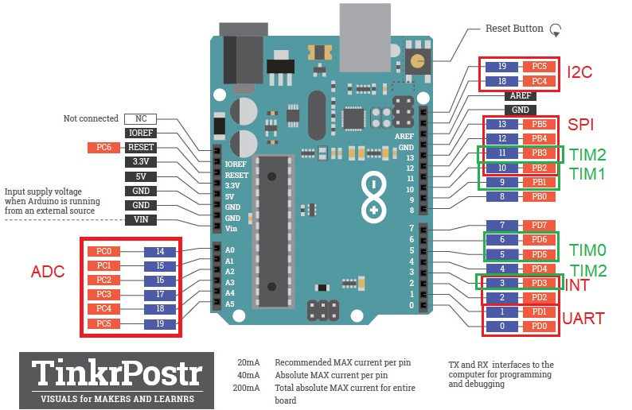
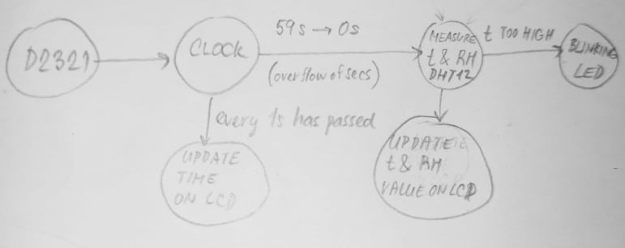

https://github.com/xhorna16/Digital-electronics-2/edit/main/Labs/08-i2c/REDAME.md
## Pinout

## Code
```c
ISR(TIMER1_OVF_vect)
{
    static state_t state = STATE_IDLE;  // Current state of the FSM
    static uint8_t addr = 7;            // I2C slave address
    uint8_t result = 1;                 // ACK result from the bus
    char uart_string_dec[] = "000"; // String for converting numbers by itoa()
    char uart_string_bin[] = "0000000";
    // FSM
    switch (state)
    {
    // Increment I2C slave address
    case STATE_IDLE:
        addr++;
        // If slave address is between 8 and 119 then move to SEND state
        if (addr > 7 && addr < 120) {
            state = STATE_SEND;
        }
        else {
            addr = 7;
            state = STATE_IDLE;
        }
        break;
    
    // Transmit I2C slave address and get result
    case STATE_SEND:
        // I2C address frame:
        // +------------------------+------------+
        // |      from Master       | from Slave |
        // +------------------------+------------+
        // | 7  6  5  4  3  2  1  0 |     ACK    |
        // |a6 a5 a4 a3 a2 a1 a0 R/W|   result   |
        // +------------------------+------------+
        result = twi_start((addr<<1) + TWI_WRITE);
        /* Test result from I2C bus. If it is 0 then move to ACK state, 
         * otherwise move to IDLE */
        if (result == 1) {
            state = STATE_IDLE;
        }            
        if (result == 0) {
            data = twi_read_ack();
            state = STATE_ACK;
        }            
        twi_stop();        
        break;

    // A module connected to the bus was found
    case STATE_ACK:
        // Send info about active I2C slave to UART and move to IDLE
        itoa(addr, uart_string_dec, 10);
        itoa(addr, uart_string_bin, 16);
        uart_puts("Address found: ");
        uart_puts(uart_string_dec);
        uart_puts("[0x");
        uart_puts(uart_string_bin);
        uart_puts("]");
        uart_puts("\n\r");
        
        state = STATE_IDLE;
        break;

    // If something unexpected happens then move to IDLE
    default:
        state = STATE_IDLE;
        break;
    }
}
```
## Weather station

